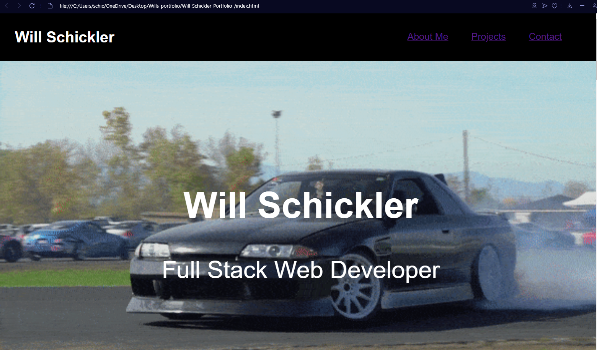

# Module-2-Challenge

## Description

This Module 2 Challenge was given to me to complete. The goal was to build a portfolio using HTML and CSS that can be used to store current and future completed projects during time spent in the U of O bootcamp.

## Installation

N/A

## Usage

To use this webpage, you can click the links in the navigation bar to redirect you to the topic you would like to read about, or simply scroll down.

## Credits

I worked on this project with my study group peers, Chase Seeberger and Shelby Hutchinson.

## Link

https://github.com/willber10/Will-Schickler-Portfolio-

## Screenshot

## License

Please refer to the LICENSE in the repository.